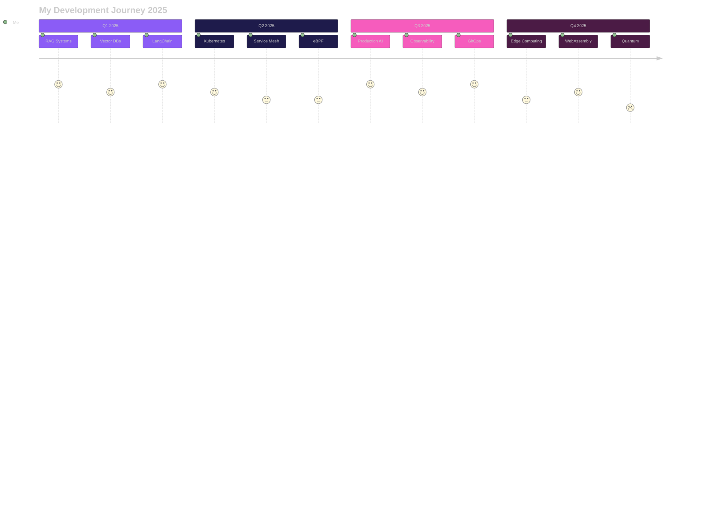

<!-- Clean Animated Header -->

<!-- Social Links -->

  
  
  
  
  
  

 

<!-- Live Stats -->

  
  
  
  
  

 

<!-- Dynamic Typing Animation -->

  

<!-- Gradient Divider -->

 

<!-- About Me Section -->
<h2 align="center">
  
  Welcome to My Universe!
</h2>

  

  

  <h3 align="center">
    
    Amir Tlinov | <code>@iMAGRAY</code>
  </h3>

   

  <!-- Gradient Separator -->
  

    
  

  <!-- Philosophy Card -->
  <h3 align="center">💭 <b>Engineering Philosophy</b></h3>
  

    <strong>🎯 "Design docs first, API-first, Production-ready only"</strong> 
    <strong>📊 "Measure everything that matters"</strong> 
    <strong>⚡ "Zero downtime is the only way"</strong>
  

  <!-- Mission Card -->
  <h3 align="center">🚀 <b>Current Mission</b></h3>
  

    <strong>🤖 Building</strong> Deep-profile AI tools with production-grade quality 
    <strong>🏗️ Architecting</strong> Scalable systems that never sleep 
    <strong>☁️ Creating</strong> Cloud-native solutions that just work
  

  <!-- Core Values Card -->
  <h3 align="center">💎 <b>Core Values</b></h3>
  

    <strong>📐 Architecture:</strong> Clean, scalable, maintainable 
    <strong>🔧 Engineering:</strong> Measure everything that matters 
    <strong>🚀 Deployment:</strong> Zero-downtime is the only way 
    <strong>🛡️ Security:</strong> Zero-trust by default
  

  <!-- Currently Learning Card -->
  <h3 align="center">📚 <b>Currently Exploring</b></h3>
  

    <strong>🧠 Advanced RAG Systems</strong> & Semantic Search 
    <strong>💾 Vector Database</strong> Optimization (Pinecone, Weaviate) 
    <strong>🔬 LLM Fine-tuning</strong> with LoRA & QLoRA 
    <strong>🌐 Service Mesh</strong> Architecture & eBPF
  

  

 
 

<!-- Gradient Divider -->

 

<!-- Technical Proficiency -->
<h2 align="center">
  
  <b>Technical Mastery</b>
  
</h2>

  <table>
    <tr>
      <td align="center" width="50%">
        
          
          
        
        
         
        
        
      </td>
      <td align="center" width="50%">
        
          
          
        
        
         
        
        
      </td>
    </tr>
    <tr>
      <td align="center" width="50%">
        
          
          
        
        
         
        
        
      </td>
      <td align="center" width="50%">
        
          
          
        
        
         
        
        
      </td>
    </tr>
  </table>

 

<!-- Technology Stack -->
<h2 align="center">
  
  <b>Complete Technology Arsenal</b>
</h2>

  

  
<b>🚀 Languages & Frameworks</b>

   

  

  

  

  
<b>☁️ Cloud & Infrastructure</b>

   

  

  

  

  
<b>🤖 AI & Data Science</b>

   

  

  

  

  
<b>🛠️ Tools & Monitoring</b>

   

  

  

 

<!-- Featured Projects -->
<h2 align="center">
  
  <b>Featured Projects</b>
  
</h2>

  <table>
    <tr>
      <td width="50%">
        

          
           
          
          
          
        

      </td>
      <td width="50%">
        

          
           
          
          
          
        

      </td>
    </tr>
    <tr>
      <td width="50%">
        

          
           
          
          
          
        

      </td>
      <td width="50%">
        

          
           
          
          
          
        

      </td>
    </tr>
  </table>

 

<!-- GitHub Analytics -->
<h2 align="center">
  
  <b>GitHub Analytics Dashboard</b>
</h2>

  <!-- Stats Cards Row -->
  

    
    
  

  <!-- Language Stats -->
  

    
    
  

 

<!-- Contribution Graph -->

  

 

<!-- Achievement Trophies -->
<h2 align="center">
  🏆 <b>GitHub Achievement Showcase</b> 🏆
</h2>

  

 

<!-- Professional Focus Areas -->
<h2 align="center">
  💼 <b>Professional Focus Areas</b>
</h2>

  <table width="100%">
    <tr>
      <td align="center" width="25%">
        <h3>🤖 AI Development</h3>
        

          <b>Deep-profile AI tools</b> 
          <b>Semantic search systems</b> 
          <b>Embedding solutions</b> 
          <b>LLM integrations</b> 
          <b>RAG architectures</b>
        

         
        LangChain • LlamaIndex • Pinecone • Weaviate • OpenAI • Anthropic APIs
      </td>
      <td align="center" width="25%">
        <h3>🏗️ System Architecture</h3>
        

          <b>API-first design</b> 
          <b>Microservices</b> 
          <b>Event-driven systems</b> 
          <b>Distributed computing</b> 
          <b>High availability</b>
        

         
        Clean Architecture • Domain-Driven Design • SOLID • DRY • KISS
      </td>
      <td align="center" width="25%">
        <h3>⚙️ DevOps & SRE</h3>
        

          <b>Zero-downtime deployments</b> 
          <b>Observability & monitoring</b> 
          <b>Infrastructure as code</b> 
          <b>CI/CD pipelines</b> 
          <b>GitOps workflows</b>
        

         
        SLI/SLO/SLA tracking • MTTR optimization • Four Golden Signals
      </td>
      <td align="center" width="25%">
        <h3>☁️ Cloud Native</h3>
        

          <b>Kubernetes</b> 
          <b>Service Mesh</b> 
          <b>eBPF</b> 
          <b>Serverless</b> 
          <b>Edge Computing</b>
        

         
        Istio • Linkerd • Cilium • Lambda • CloudFlare Workers
      </td>
    </tr>
  </table>

 

<!-- Development Environment -->
<h2 align="center">
  
  <b>Development Environment</b>
</h2>

  

    
<b>⚙️ My Setup & Configuration</b>

     

<table>
  <tr>
    <td align="center" width="33%">
      <h4>💻 Hardware</h4>
      <b>AMD Ryzen 9 7950X</b> 
      <b>NVIDIA RTX 4090</b> 
      <b>64GB DDR5</b> 
      <b>2TB NVMe Gen4</b>
    </td>
    <td align="center" width="33%">
      <h4>🖥️ Environment</h4>
      <b>Arch Linux / macOS</b> 
      <b>Hyprland WM</b> 
      <b>Alacritty + Tmux</b> 
      <b>Zsh + Starship</b>
    </td>
    <td align="center" width="33%">
      <h4>🛠️ Development</h4>
      <b>Neovim (LazyVim)</b> 
      <b>VSCode</b> 
      <b>Tokyo Night Theme</b> 
      <b>Fira Code Nerd Font</b>
    </td>
  </tr>
</table>

  

 

<!-- Development Journey Roadmap -->
<h2 align="center">
  🎯 <b>Development Journey 2025</b>
</h2>

 

<!-- Connect Section -->
<h2 align="center">
  
   
  <b>Let's Connect & Build Something Amazing!</b>
</h2>

  
  
  
  
  
  

    

  
  
  

 

<!-- Support Section -->
<h2 align="center">
  💝 <b>Support My Work</b>
</h2>

  
  
  

 

<!-- Footer Wave -->

<!-- Final Gradient Line -->

<!-- Hidden Message for Recruiters -->
<!--
  Hello recruiter! 👋
  Thank you for checking my profile source code!
  I'm passionate about building production-ready systems and always open to interesting opportunities.
  Feel free to reach out at amir@imagray.dev
-->
