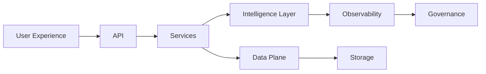

<!-- Hero Banner -->

  

  <strong>Root governance, discovery and safety hub for deep-profile AI systems.</strong> 
  Evidence-driven delivery across architecture, platforms and AI product engineering.

  
  
  
  
  
  

  
  
  

## Table of Contents
- [Executive Overview](#executive-overview)
- [Strategic Focus](#strategic-focus)
- [Service Portfolio](#service-portfolio)
- [Capability Matrix](#capability-matrix)
- [Operating Principles](#operating-principles)
- [Engagement Framework](#engagement-framework)
- [Technology Stack](#technology-stack)
- [Architecture Snapshot](#architecture-snapshot)
- [Thought Leadership](#thought-leadership)
- [Contact](#contact)

## Executive Overview
Amir Tlinov builds and scales deep-profile AI platforms that combine rigorous governance with measurable product outcomes. Programs are driven by design documentation, API-first patterns and production-readiness as a baseline, ensuring repeatable delivery across regulated environments. Current mandate concentrates on aligning discovery intelligence with enterprise-grade safety and compliance.

### Positioning Statement
- Principal AI architect spanning solution design, platform enablement and delivery leadership
- Strong bias toward metrics, observability and continuous verification across the software lifecycle
- Portfolio anchored in production AI, including retrieval-augmented generation, vector search optimisation and intelligent observability

## Strategic Focus

  
2025 Priorities

  - Delivering scalable AI infrastructure with deterministic deployment pipelines and SBOM-backed supply chain controls
  - Advancing retrieval-augmented generation systems for high-signal knowledge discovery and decisioning support
  - Expanding experimentation frameworks that couple evaluation harnesses with telemetry-driven feedback loops

  
Mission Anchors

  - Establish design-first execution where architecture artifacts lead implementation
  - Embed safety guardrails and policy enforcement across agents, data flows and runtime surfaces
  - Maintain production-ready standards for every initiative, ensuring smooth transition from prototype to scale

## Service Portfolio
| Service Line | Outcomes | Engagement Signals |
| --- | --- | --- |
| AI Product Architecture | Blueprinting domain-specific agents, knowledge graphs and decision layers | You need clarity on system boundary, SLAs and compliance posture |
| Platform Engineering | Standing up cloud-native delivery foundations, automation and observability | You are scaling from MVP to enterprise footprint |
| Applied AI Research | Experimentation on RAG, embeddings and evaluation suites | You require rapid iteration with reproducibility baked in |
| Advisory & Governance | Policy frameworks, risk assessments and capability maturity audits | You must align leadership on AI readiness and safety |

## Capability Matrix
| Domain | Expertise Highlights | Tooling & Frameworks |
| --- | --- | --- |
| Languages | Rust, Python, TypeScript, Go | Bazel, Poetry, pnpm, cargo workspaces |
| AI & ML | PyTorch, TensorFlow, OpenAI ecosystem, ONNX runtime, vector databases | Weights & Biases, Evidently, LangSmith |
| Cloud & DevOps | AWS, GCP, Kubernetes, Terraform, GitHub Actions | ArgoCD, Crossplane, Atlantis |
| Data & Analytics | PostgreSQL, Redis, MongoDB, Elasticsearch, DuckDB | dbt, Airflow, Apache Beam |
| Security & Compliance | SBOM automation, secret scanning, policy-as-code | Syft, Grype, OPA/Rego, Semgrep |

## Operating Principles
- Design documentation leads implementation; every initiative starts with architecture narratives, sequence diagrams and risk registers.
- API-first delivery ensures external and internal consumers benefit from consistent contracts, versioning and change management.
- Production-ready only: systems ship with observability, performance baselines, rollback strategies and on-call playbooks.
- Quantitative rigour: dashboards and experimentation metrics define success and inform iteration.

## Engagement Framework

  
Standard Delivery Lifecycle

  1. Discovery and alignment workshops capturing objectives, data sources, regulatory constraints and success metrics.
  2. Blueprint phase producing architecture dossiers, evaluation plans and governance checkpoints.
  3. Implementation sprints combining platform automation, model integration and policy enforcement.
  4. Operationalisation with telemetry onboarding, runbooks, and readiness reviews before scale deployment.

  
Assurance Layers

  - Deterministic builds with Bazel or Nix Flakes, including artifact hashing for traceability
  - Continuous SBOM generation via Syft and vulnerability analysis with Grype
  - Diff-aware static analysis (Semgrep, CodeQL) and merge simulation prior to release
  - Policy evaluation integrating security gating, impact thresholds and stakeholder approvals

## Technology Stack

  

### Toolchain Highlights
- Infrastructure as code through Terraform, Crossplane and automation pipelines anchored in GitOps.
- AI experimentation tracked with Weights & Biases, automated evaluation harnesses and benchmark-driven release cadences.
- Secure software supply chain rooted in deterministic builds, SBOM visibility and dependency risk scoring.

## Architecture Snapshot

## Thought Leadership
- Author of deep-profile AI tooling and infrastructure articles on Dev.to and LinkedIn
- Regular contributor to architectural guidelines emphasising safety and compliance for AI systems
- Active in cross-functional guilds shaping standards for documentation, evaluation and release management

## Contact
- Email: [amir@imagray.dev](mailto:amir@imagray.dev)
- LinkedIn: [linkedin.com/in/iMAGRAY](https://linkedin.com/in/iMAGRAY)
- GitHub: [github.com/iMAGRAY](https://github.com/iMAGRAY)
- Advisory requests: please include scope, timelines, compliance requirements and success metrics in your first note.

---

Updated September&nbsp;16,&nbsp;2025 &middot; Built for clarity, governance and execution excellence.

