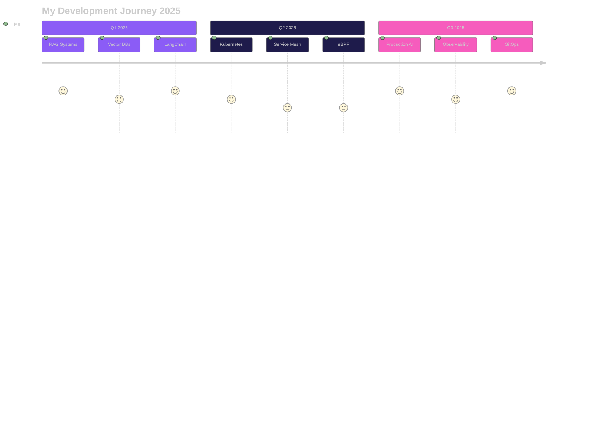

<!-- Animated Gradient Header with Particles Effect -->

  

<!-- Animated Rainbow Line -->

<!-- Dynamic Role Typing Animation -->

  

<!-- Animated Social Links with Hover Effects -->

   
  
  
  
  
  
  
  

<!-- Animated Stats Dashboard -->

   
  
  
  
  
  
  

<!-- Wave Separator -->

<!-- ABOUT ME SECTION - CENTERED BEAUTIFUL TEXT -->

  
  # 👋 Welcome to My Digital Space
  
  
  
  

    
  <h2>🚀 Amir Tlinov | <code>@iMAGRAY</code></h2>
  
   
  
  ### 💭 **Philosophy**
  > ***"Design docs first, API-first, Production-ready only"***
  
   
  
  ### 🎯 **Current Mission**
  **🤖 Building** Deep-profile AI tools with production-grade quality  
  **🏗️ Architecting** Scalable systems that never sleep  
  **☁️ Creating** Cloud-native solutions that just work  
  
   
  
  ### ⚡ **Core Values**
  **📐 Architecture:** Clean, scalable, maintainable  
  **🔧 Engineering:** Measure everything that matters  
  **🚀 Deployment:** Zero-downtime is the only way  
  **🛡️ Security:** Zero-trust by default  
  
   
  
  ### 🔭 **Currently Exploring**
  **→** Advanced RAG Systems & Semantic Search  
  **→** Vector Database Optimization (Pinecone, Weaviate)  
  **→** LLM Fine-tuning with LoRA & QLoRA  
  **→** Service Mesh Architecture & eBPF  
  
  

 
 

<!-- Animated Gradient Divider -->

  

<!-- TECHNICAL SKILLS WITH ANIMATED PROGRESS BARS -->

  
  # 💻 Technical Proficiency
  
  
  

  <table>
    <tr>
      <td align="center" width="33%">
        <h3>🚀 Languages</h3>
        
          
        
        
         
        
        
      </td>
      <td align="center" width="33%">
        <h3>🤖 AI & ML</h3>
        
          
        
        
         
        
        
      </td>
      <td align="center" width="33%">
        <h3>☁️ Cloud & DevOps</h3>
        
          
        
        
         
        
        
      </td>
    </tr>
  </table>

<!-- Full Tech Stack Display -->

  <h2>⚡ Complete Technology Arsenal</h2>
  
  

    
<b>Click to see all technologies</b>

     
    
  
    
  

 

<!-- Projects Section with 3D Card Effects -->

  
  # 🚀 Featured Projects
  
  <table>
    <tr>
      <td width="50%">
        <h3 align="center">ASTSentinel</h3>
        

          
            
          

            
            
            
          

        

      </td>
      <td width="50%">
        <h3 align="center">ArchLens</h3>
        

          
            
          

            
            
            
          

        

      </td>
    </tr>
    <tr>
      <td width="50%">
        <h3 align="center">CogniVault</h3>
        

          
            
          

            
            
            
          

        

      </td>
      <td width="50%">
        <h3 align="center">PSQL SSH API MCP</h3>
        

          
            
          

            
            
            
          

        

      </td>
    </tr>
  </table>

 

<!-- GitHub Analytics Dashboard -->

  
  # 📊 GitHub Analytics Dashboard
  
  
  
  
    
  
  
  
  

 

<!-- Contribution Graph -->

  

 

<!-- Trophy Showcase -->

  
  # 🏆 Achievement Trophies
  
  
  

 

<!-- Professional Focus Areas - CENTERED TEXT -->

  
  # 💼 Professional Focus Areas
  
  <table>
    <tr>
      <td align="center" width="25%">
        
          
        <h3>🤖 AI Systems</h3>
        

          <b>Deep-profile AI tools</b> 
          <b>RAG architectures</b> 
          <b>LangChain & Embeddings</b> 
          <b>Vector databases</b>
        

      </td>
      <td align="center" width="25%">
        
          
        <h3>🏗️ System Design</h3>
        

          <b>Microservices</b> 
          <b>Event-driven systems</b> 
          <b>Domain-Driven Design</b> 
          <b>API-first approach</b>
        

      </td>
      <td align="center" width="25%">
        
          
        <h3>⚙️ DevOps/SRE</h3>
        

          <b>CI/CD pipelines</b> 
          <b>GitOps workflows</b> 
          <b>Infrastructure as Code</b> 
          <b>Observability</b>
        

      </td>
      <td align="center" width="25%">
        
          
        <h3>☁️ Cloud Native</h3>
        

          <b>Kubernetes</b> 
          <b>Service Mesh</b> 
          <b>eBPF</b> 
          <b>Serverless</b>
        

      </td>
    </tr>
  </table>
  

 

<!-- Development Roadmap -->

  
  # 🎯 Development Roadmap 2025
  

 

<!-- Engineering Principles -->

  
  # 💡 Engineering Principles
  
  <table>
    <tr>
      <td align="center" width="20%">
        
          
        <b>API-first</b> 
        Always start with design docs
      </td>
      <td align="center" width="20%">
        
          
        <b>Measure</b> 
        Everything that matters
      </td>
      <td align="center" width="20%">
        
          
        <b>Zero-trust</b> 
        Security by default
      </td>
      <td align="center" width="20%">
        
          
        <b>p95/p99</b> 
        Performance control
      </td>
      <td align="center" width="20%">
        
          
        <b>Zero downtime</b> 
        Always available
      </td>
    </tr>
  </table>
  

 

<!-- Development Environment -->

  
  # ⚙️ Development Environment
  
  

    
<b>🖥️ Click to expand full setup</b>

     
    
  | Category | Stack |
  |:---------|:------|
  | **💻 Hardware** | `AMD Ryzen 9 7950X` • `RTX 4090` • `64GB DDR5` • `2TB NVMe Gen4` |
  | **🖥️ OS** | `Arch Linux` • `macOS Sonoma` • `Windows 11 + WSL2` |
  | **🎨 Editors** | `Neovim (LazyVim)` • `VSCode` • `Zed` • `IntelliJ IDEA` |
  | **🛠️ Terminal** | `Alacritty` • `Tmux` • `Zsh + Oh My Zsh` • `Starship` |
  | **🎯 Theme** | `Tokyo Night` • `Fira Code Nerd Font` |
  | **🚀 Tools** | `Docker` • `K3s` • `Git` • `GitHub CLI` • `Postman` |
  | **📊 Monitoring** | `Prometheus` • `Grafana` • `Jaeger` • `ELK Stack` |
  
  

  

 

<!-- Connect Section -->

  
  # 🤝 Let's Connect & Collaborate!
  
  
  
   
  
  
  
  
  
  
  
  
   
  
  
  
  
  

 

<!-- Support Section -->

  
  # ☕ Support My Work
  
  
<b>If you find my work valuable, consider supporting me!</b>

  
  
  
  
  

 

<!-- Snake Animation -->

  

<!-- Footer Wave -->

<!-- Hidden Message for Developers -->
<!-- 
  👋 Hey there, fellow developer!
  Thanks for checking out my source code!
  If you're looking for someone passionate about
  clean code and scalable systems, let's talk!
  
  📧 amir@imagray.dev
  🔗 https://github.com/iMAGRAY
-->
