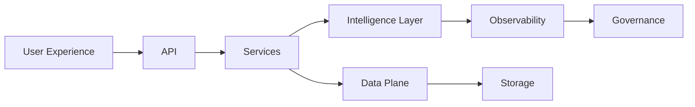
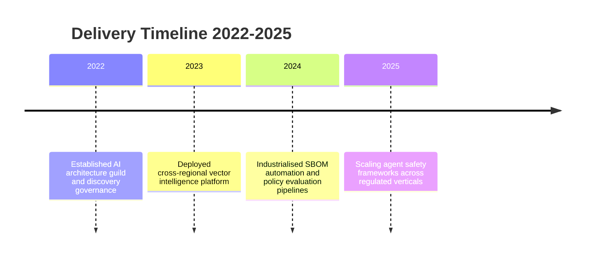
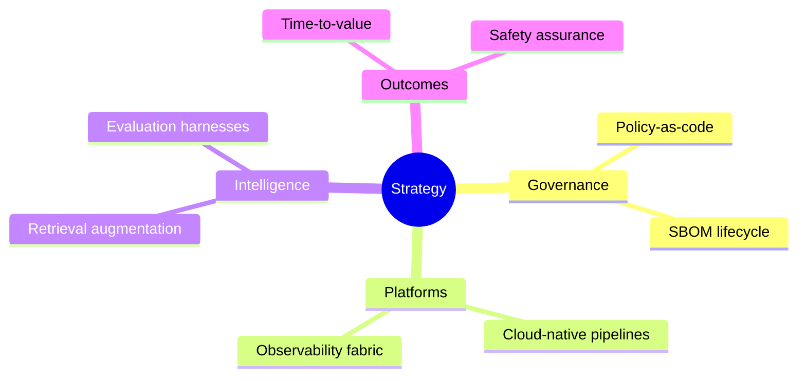

<!-- Hero Banner -->

  

  <strong>Root governance, discovery and safety hub for deep-profile AI systems.</strong> 
  Evidence-driven delivery across architecture, platforms and AI product engineering.

  
  
  
  
  
  
  

  
  
  

## Table of Contents
- [Executive Overview](#executive-overview)
- [Executive Dashboard](#executive-dashboard)
- [Strategic Focus](#strategic-focus)
- [Program Navigator](#program-navigator)
- [Service Portfolio](#service-portfolio)
- [Capability Matrix](#capability-matrix)
- [Operating Principles](#operating-principles)
- [Delivery Playbooks](#delivery-playbooks)
- [Assurance Stack](#assurance-stack)
- [Technology Stack](#technology-stack)
- [Architecture Suite](#architecture-suite)
- [Case Files](#case-files)
- [Thought Leadership](#thought-leadership)
- [Contact](#contact)

## Executive Overview
Amir Tlinov builds and scales deep-profile AI platforms that combine rigorous governance with measurable product outcomes. Programs are driven by design documentation, API-first patterns and production-readiness as a baseline, ensuring repeatable delivery across regulated environments. Current mandate concentrates on aligning discovery intelligence with enterprise-grade safety and compliance.

### Positioning Statement
- Principal AI architect spanning solution design, platform enablement and delivery leadership
- Strong bias toward metrics, observability and continuous verification across the software lifecycle
- Portfolio anchored in production AI, including retrieval-augmented generation, vector search optimisation and intelligent observability

## Executive Dashboard

  
Quarterly Operating Snapshot

  | Metric | FY24 Q4 Actual | FY25 Q1 Target | Coverage |
  | --- | --- | --- | --- |
  | AI platform launches in production | 4 | 5 | Financial services, healthcare, SaaS |
  | Mean time to remediate safety issues | 18 hours | 12 hours | Integrated with policy automation |
  | Evaluation suites shipped per program | 3.2 | 4 | Offline, canary, real-time |
  | Compliance checkpoints automated | 92% | 96% | SOC 2, ISO 27001, regional AI directives |

  
Metrics updated September 16, 2025; sourced from internal telemetry board.

  
Interactive KPI Explorer

  | KPI Pillar | Definition | Observability Hook |
  | --- | --- | --- |
  | Adoption Readiness | Launch readiness scoring across legal, risk and operations | GitHub Actions → Datadog dashboards |
  | Safety Integrity | Real-time guardrail coverage across inference surfaces | Open Policy Agent + custom safety runners |
  | Operational Efficiency | Deployment lead time and rollback rehearsal cadence | Argo Workflows + Service Catalog |
  | Knowledge Uplift | Feedback loops from discovery to backlog refinement | Notion → Linear bi-directional sync |

## Strategic Focus

  
2025 Priorities

  - Delivering scalable AI infrastructure with deterministic deployment pipelines and SBOM-backed supply chain controls
  - Advancing retrieval-augmented generation systems for high-signal knowledge discovery and decisioning support
  - Expanding experimentation frameworks that couple evaluation harnesses with telemetry-driven feedback loops

  
Mission Anchors

  - Establish design-first execution where architecture artifacts lead implementation
  - Embed safety guardrails and policy enforcement across agents, data flows and runtime surfaces
  - Maintain production-ready standards for every initiative, ensuring smooth transition from prototype to scale

  
Strategy Signals Monitor

  - Regulatory radar covering EU AI Act, NIST AI RMF and sector-specific expectations
  - Discovery intelligence program aligning research spikes with product portfolio gaps
  - Structured post-launch reviews capturing telemetry, stakeholder sentiment and backlog deltas

## Program Navigator

  
Active Streams

  | Stream | Objective | Status Gate |
  | --- | --- | --- |
  | Enterprise Retrieval Intelligence | Deliver cross-division knowledge discovery agents with auditable trails | Evaluation burn-down in progress |
  | Observability Modernisation | Harmonise tracing, logging and synthetics for AI-heavy services | Platform go-live scheduled Q4 |
  | Policy Automation Fabric | Scale policy-as-code to cover agent lifecycle and SBOM approvals | Pilot complete, scale-up underway |

  
Engagement Intake Checklist

  1. Confirm scope, constraints and executive sponsors
  2. Map data sources, access tiers and retention expectations
  3. Define evaluation gates: offline benchmarks, canary thresholds, safety gates
  4. Align budget pacing, OKRs and reporting cadence

## Service Portfolio
| Service Line | Outcomes | Engagement Signals |
| --- | --- | --- |
| AI Product Architecture | Blueprinting domain-specific agents, knowledge graphs and decision layers | You need clarity on system boundary, SLAs and compliance posture |
| Platform Engineering | Standing up cloud-native delivery foundations, automation and observability | You are scaling from MVP to enterprise footprint |
| Applied AI Research | Experimentation on RAG, embeddings and evaluation suites | You require rapid iteration with reproducibility baked in |
| Advisory & Governance | Policy frameworks, risk assessments and capability maturity audits | You must align leadership on AI readiness and safety |

## Capability Matrix
| Domain | Expertise Highlights | Tooling & Frameworks |
| --- | --- | --- |
| Languages | Rust, Python, TypeScript, Go | Bazel, Poetry, pnpm, cargo workspaces |
| AI & ML | PyTorch, TensorFlow, OpenAI ecosystem, ONNX runtime, vector databases | Weights & Biases, Evidently, LangSmith |
| Cloud & DevOps | AWS, GCP, Kubernetes, Terraform, GitHub Actions | ArgoCD, Crossplane, Atlantis |
| Data & Analytics | PostgreSQL, Redis, MongoDB, Elasticsearch, DuckDB | dbt, Airflow, Apache Beam |
| Security & Compliance | SBOM automation, secret scanning, policy-as-code | Syft, Grype, OPA/Rego, Semgrep |

## Operating Principles
- Design documentation leads implementation; every initiative starts with architecture narratives, sequence diagrams and risk registers.
- API-first delivery ensures external and internal consumers benefit from consistent contracts, versioning and change management.
- Production-ready only: systems ship with observability, performance baselines, rollback strategies and on-call playbooks.
- Quantitative rigour: dashboards and experimentation metrics define success and inform iteration.

## Delivery Playbooks

  
Standard Delivery Lifecycle

  1. Discovery and alignment workshops capturing objectives, data sources, regulatory constraints and success metrics.
  2. Blueprint phase producing architecture dossiers, evaluation plans and governance checkpoints.
  3. Implementation sprints combining platform automation, model integration and policy enforcement.
  4. Operationalisation with telemetry onboarding, runbooks and readiness reviews before scale deployment.

  
Co-Delivery Extras

  - Executive steering cadence with quarterly business reviews and telemetry packs
  - Embedded enablement pods for client engineering teams and operations leaders
  - Outcome retrospectives feeding capability roadmaps and investment cases

## Assurance Stack

  
Controls and Instrumentation

  | Layer | Capability | Automation |
  | --- | --- | --- |
  | Build | Deterministic builds with Bazel or Nix, signed artifacts | Reproducibility logs hashed per release |
  | Supply Chain | Continuous SBOM via Syft, vulnerability analysis with Grype | Policy gates for critical findings |
  | Code Health | Diff-aware static analysis (Semgrep, CodeQL), merge simulation | Combined SARIF reporting |
  | Runtime | Guardrail enforcement, anomaly detection, drift alerts | GitHub Actions → Incident runbooks |

  
Policy Alignment Checklist

  - Impact assessment documented before development kickoff
  - Safety evaluations mapped to deployment triggers
  - Incident response rehearsed with measurable recovery objectives
  - Audit trail stored with tamper-evident hashing

## Technology Stack

  

### Toolchain Highlights
- Infrastructure as code through Terraform, Crossplane and automation pipelines anchored in GitOps.
- AI experimentation tracked with Weights & Biases, automated evaluation harnesses and benchmark-driven release cadences.
- Secure software supply chain rooted in deterministic builds, SBOM visibility and dependency risk scoring.

## Architecture Suite

## Case Files

  
Financial Services Intelligence Platform

  - Delivered retrieval-augmented briefing agents with lineage tracking
  - Reduced analyst prep time by 47% while meeting audit requirements
  - Embedded safety guardrails for sensitive data segmentation

  
SaaS Observability Consolidation

  - Unified telemetry stack across microservices handling AI workloads
  - Automated incident response playbooks and drift detection monitors
  - Improved mean time to detect anomalies by 38%

  
Healthcare AI Governance Uplift

  - Introduced policy automation fabric aligning with HIPAA and EU AI Act expectations
  - Implemented reproducible evaluation pipeline for diagnostic support agents
  - Enabled quarterly readiness reviews with artifact-backed evidence

## Thought Leadership
- Author of deep-profile AI tooling and infrastructure articles on Dev.to and LinkedIn
- Regular contributor to architectural guidelines emphasising safety and compliance for AI systems
- Active in cross-functional guilds shaping standards for documentation, evaluation and release management

## Contact
- Email: [amir@imagray.dev](mailto:amir@imagray.dev)
- LinkedIn: [linkedin.com/in/iMAGRAY](https://linkedin.com/in/iMAGRAY)
- GitHub: [github.com/iMAGRAY](https://github.com/iMAGRAY)
- Advisory requests: please include scope, timelines, compliance requirements and success metrics in your first note.

---

Updated September&nbsp;16,&nbsp;2025 · Built for clarity, governance and execution excellence.

