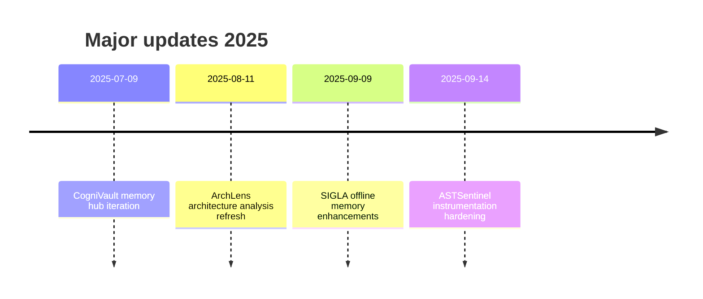

<!-- Hero Banner -->

  <picture>
    <source media="(prefers-color-scheme: dark)" srcset="https://capsule-render.vercel.app/api?type=waving&color=0:020617,50:0b1a37,100:0f172a&height=260&section=header&text=Amir%20Tlinov&fontSize=86&fontAlign=50&fontAlignY=40&desc=Principal%20AI%20Engineer%20%7C%20Systems%20Strategist&descSize=22&descAlign=50&descAlignY=58" />
    
  </picture>

  <strong>Deep-profile AI and developer tooling across deterministic Rust services, vector memory infrastructure, and safety-first evaluation flows.</strong> 
  Grounded in transparent metrics, auditable pipelines, and reproducible delivery for local-first and regulated environments.

  
  
  
  
  

---

## Operating Snapshot · 16 Sep 2025
| Metric | Value |
| --- | --- |
| Public repositories | 14 |
| Followers | 3 |
| Stars received | 11 |

Figures captured from the GitHub profile dashboard on 16 September 2025.citeturn2view1

## Focus Streams

  
<strong>ASTSentinel</strong> · deterministic AST instrumentation for Claude Code (Rust)

  - Детерминированный набор AST-проверок и хуков покрывает pre/post tool сценарии, удерживая выводы воспроизводимыми во всех точках входа Claude Code.citeturn3view0
  - Продакшн-ветки запрещают `panic!`/`unwrap!` и форсируют типизированную обработку ошибок со структурным логированием ради чистых JSON-контрактов.citeturn3view0
  - Последние изменения зафиксированы 14 сентября 2025 года.citeturn3view1

  
<strong>ArchLens</strong> · AI-assisted architecture analysis (Rust)

  - Выявляет code smells, нарушения SOLID и архитектурные антипаттерны с оценкой технического долга.citeturn4view0
  - Поставляется с STDIO MCP-сервером, CLI и библиотечным API для интеграции в AI-пайплайны.citeturn4view0
  - Репозиторий обновлён 11 августа 2025 года.citeturn3view1

  
<strong>CogniVault</strong> · pluggable Rust memory hub for embeddings and vector search

  - Runtime-агностичный хаб с поддержкой async-std/tokio, шифрованным Sled-хранилищем и SIMD HNSW-поиском.citeturn5view0
  - Плагины через `cdylib` и WASI проходят Ed25519-подпись перед загрузкой, сохраняя контроль расширений.citeturn5view0
  - Активность зафиксирована 9 июля 2025 года.citeturn3view3

  
<strong>SIGLA</strong> · local vector memory system for agents (Python)

  - Даёт офлайн-поиск на HNSW с NumPy-фолбэком, персистентность на SQLite+FTS5 и API для памяти агента.citeturn6view0
  - Включает бенчмарки, автооптимизацию и FastAPI-надстройки, оставаясь GPU-опциональным.citeturn6view0
  - Последняя активность отмечена 9 сентября 2025 года.citeturn3view2

## Portfolio Highlights
| Project | Stack | Focus | Notes |
| --- | --- | --- | --- |
| ASTSentinel | Rust · Python | Deterministic AST hooks for Claude Code with panic-free production policy | Updated 14 Sep 2025citeturn3view0turn3view1 |
| ArchLens | Rust | Architecture analysis, MCP server, multi-language metrics | Updated 11 Aug 2025citeturn4view0turn3view1 |
| CogniVault | Rust | Memory hub with pluggable backends and observability guardrails | Updated 9 Jul 2025citeturn5view0turn3view3 |
| SIGLA | Python · Shell | Local agent memory with HNSW index, SQLite storage, and REST extras | Updated 9 Sep 2025citeturn6view0turn3view2 |

## Operating Practices
- Придерживаемся воспроизводимых сборок и паник-фри пайплайнов в Rust-сервисах.citeturn3view0
- Экспортируем инструменты через MCP и CLI, чтобы AI-агенты и разработчики работали с едиными структурами данных.citeturn4view0turn5view0turn6view0
- Совмещаем исследования памяти и наблюдаемость, поддерживая офлайн-фолбэки до включения опциональных расширений.citeturn5view0turn6view0

## Activity Timeline

Обновления июля–сентября 2025 охватывают память на Rust, архитектурную аналитику и усиление AST-инструментации.citeturn3view1turn3view2turn3view3

## Tooling & Capabilities

  

- Rust доминирует в системной части, Python и shell применяются в SIGLA и вспомогательных скриптах.citeturn3view0turn6view0
- Инфраструктура базируется на метриках Prometheus, политике расширений и воспроизводимых пайплайнах.citeturn5view0turn6view0

## Contact
- GitHub: [github.com/iMAGRAY](https://github.com/iMAGRAY)
- LinkedIn: [linkedin.com/in/iMAGRAY](https://linkedin.com/in/iMAGRAY)
- Email: [amir@imagray.dev](mailto:amir@imagray.dev)

---

Updated 16 September 2025 · Built for transparent, reproducible AI tooling.

