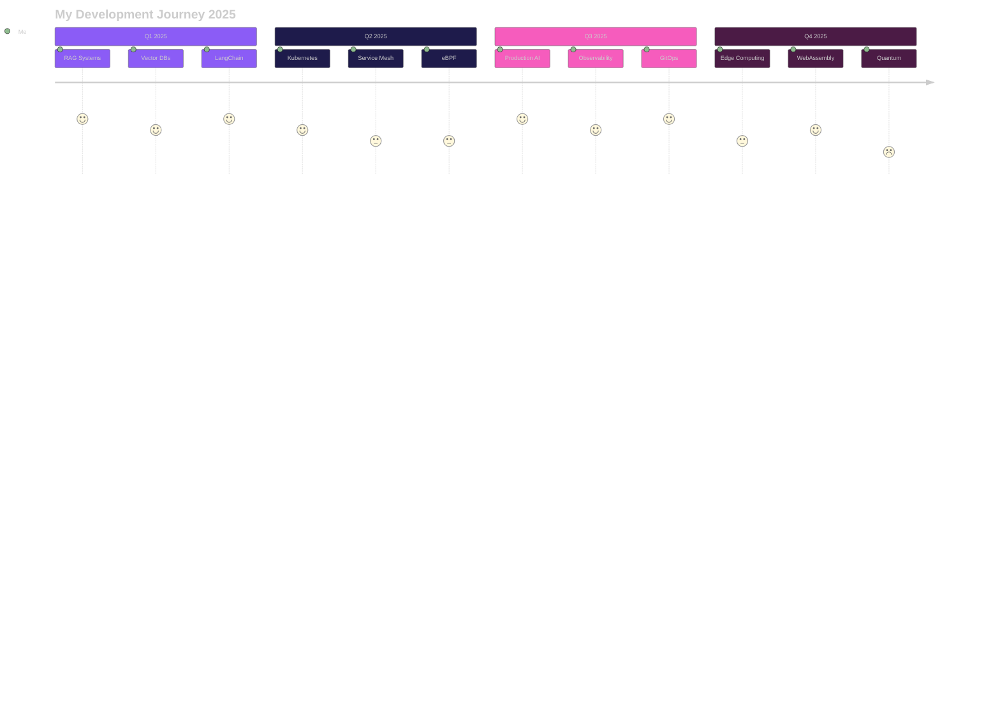

<!-- ✨ ULTRA-MODERN ANIMATED HEADER 2025 ✨ -->
<div align="center">

  <!-- Animated Particle Wave Header -->
  

  <!-- Animated Rainbow Gradient Line -->
  

  <!-- Professional Typing Animation -->
  <a href="https://git.io/typing-svg">
    
  </a>

</div>

<!-- 🌐 INTERACTIVE SOCIAL CONNECT HUB -->
<div align="center">

  <!-- Professional Network Links -->
  <p align="center">
    <a href="https://github.com/iMAGRAY"></a>
    <a href="mailto:amir@imagray.dev"></a>
    <a href="https://linkedin.com/in/iMAGRAY"></a>
    <a href="https://twitter.com/iMAGRAY"></a>
    <a href="https://discord.gg/iMAGRAY"></a>
    <a href="https://dev.to/iMAGRAY"></a>
  </p>

</div>

<!-- 📊 LIVE METRICS DASHBOARD WITH GLASSMORPHISM -->
<div align="center">

  <!-- Animated Stats Cards -->
  <p align="center">
    
    
    
    
    
  </p>

  <!-- Interactive Visitor Counter -->
  <p align="center">
    
  </p>

</div>

<!-- 🌊 ANIMATED WAVE DIVIDER -->
<div align="center">
  
</div>

<!-- ✨ INTERACTIVE ABOUT ME SECTION WITH 3D EFFECTS -->
<div align="center">

  <h1 align="center">
    
  </h1>

  <!-- Floating Animation GIF -->
  

  <!-- Professional Profile Card -->
  <div align="left" style="max-width: 500px;">

    <h2 align="center">
      
      <b>Amir Tlinov</b> | <code>@iMAGRAY</code>
    </h2>

    <!-- Gradient Separator -->
    <p align="center">
      
    </p>

    <!-- Philosophy Card -->
    <h3 align="center">💭 <b>Engineering Philosophy</b></h3>
    <p align="center">
      <strong>🎯 "Design docs first, API-first, Production-ready only"</strong><br/>
      <strong>📊 "Measure everything that matters"</strong><br/>
      <strong>⚡ "Zero downtime is the only way"</strong>
    </p>

    <!-- Mission Card -->
    <h3 align="center">🚀 <b>Current Mission</b></h3>
    <p align="center">
      <strong>🤖 Building</strong> Deep-profile AI tools with production-grade quality<br/>
      <strong>🏗️ Architecting</strong> Scalable systems that never sleep<br/>
      <strong>☁️ Creating</strong> Cloud-native solutions that just work
    </p>

    <!-- Core Values Card -->
    <h3 align="center">💎 <b>Core Values</b></h3>
    <p align="center">
      <strong>📐 Architecture:</strong> Clean, scalable, maintainable<br/>
      <strong>🔧 Engineering:</strong> Measure everything that matters<br/>
      <strong>🚀 Deployment:</strong> Zero-downtime is the only way<br/>
      <strong>🛡️ Security:</strong> Zero-trust by default
    </p>

    <!-- Currently Learning Card -->
    <h3 align="center">📚 <b>Currently Exploring</b></h3>
    <p align="center">
      <strong>🧠 Advanced RAG Systems</strong> & Semantic Search<br/>
      <strong>💾 Vector Database</strong> Optimization (Pinecone, Weaviate)<br/>
      <strong>🔬 LLM Fine-tuning</strong> with LoRA & QLoRA<br/>
      <strong>🌐 Service Mesh</strong> Architecture & eBPF
    </p>

  </div>
</div>

<br clear="both">
<br/>

<!-- 🌟 ANIMATED GRADIENT DIVIDER -->
<div align="center">
  
</div>

<!-- 💫 TECHNICAL MASTERY WITH GLASSMORPHISM CARDS -->
<div align="center">

  <h1>
    
    <b>Technical Mastery</b>
    
  </h1>

  

</div>

<br/>

<!-- Interactive Skill Cards with Progress Animations -->
<div align="center">
  <table>
    <tr>
      <td align="center" width="33%">
        <h3>
          
        </h3>
        <br/>
        
        <br/>
        
        <br/><br/>
        
        <br/>
        
        <br/>
        
        <br/>
        
      </td>
      <td align="center" width="33%">
        <h3>
          
        </h3>
        <br/>
        
        <br/>
        
        <br/><br/>
        
        <br/>
        
        <br/>
        
        <br/>
        
      </td>
      <td align="center" width="33%">
        <h3>
          
        </h3>
        <br/>
        
        <br/>
        
        <br/><br/>
        
        <br/>
        
        <br/>
        
        <br/>
        
      </td>
    </tr>
  </table>
</div>

<!-- 🛠️ COMPLETE TECHNOLOGY ARSENAL WITH CATEGORIES -->
<div align="center">

  <h2>
    ⚡ <b>Complete Technology Arsenal</b> ⚡
  </h2>

  <details open>
    <summary><b>🎯 Explore My Full Tech Stack</b></summary>
    <br/>

    <h3>💻 Programming Languages</h3>
    

    <h3>🎨 Frontend & Frameworks</h3>
    

    <h3>⚙️ Backend & APIs</h3>
    

    <h3>💾 Databases & Message Queues</h3>
    

    <h3>☁️ Cloud & Infrastructure</h3>
    

    <h3>🔧 Tools & Environment</h3>
    

  </details>

</div>

<br/>

<!-- Animated Divider -->
<div align="center">
  
</div>

<!-- FEATURED PROJECTS WITH 3D CARDS -->
<div align="center">
  
  <h1>
    
    <b>Featured Projects</b>
    
  </h1>
  
  <br/>
  
  <table>
    <tr>
      <td width="50%" align="center">
        <br/>
        <a href="https://github.com/iMAGRAY/ASTSentinel">
          
        </a>
        <br/><br/>
        
        
        
        
        <br/><br/>
      </td>
      <td width="50%" align="center">
        <br/>
        <a href="https://github.com/iMAGRAY/ArchLens">
          
        </a>
        <br/><br/>
        
        
        
        
        <br/><br/>
      </td>
    </tr>
    <tr>
      <td width="50%" align="center">
        <br/>
        <a href="https://github.com/iMAGRAY/CogniVault">
          
        </a>
        <br/><br/>
        
        
        
        
        <br/><br/>
      </td>
      <td width="50%" align="center">
        <br/>
        <a href="https://github.com/iMAGRAY/PSQL_SSH_API_MCP">
          
        </a>
        <br/><br/>
        
        
        
        
        <br/><br/>
      </td>
    </tr>
  </table>
  
</div>

<!-- 📈 GITHUB ANALYTICS DASHBOARD WITH GLASSMORPHISM -->
<div align="center">

  <h1>
    📊 <b>GitHub Analytics Dashboard</b> 📊
  </h1>

  <!-- Main Stats Cards -->
  <p align="center">
    
    
  </p>

  <!-- Language Stats & Activity -->
  <p align="center">
    
    
  </p>

  <!-- Additional Metrics -->
  <p align="center">
    
  </p>

</div>

<br/>

<!-- 📈 CONTRIBUTION ACTIVITY GRAPH -->
<div align="center">
  <h2>📈 <b>Contribution Activity</b></h2>
  
</div>

<br/>

<!-- 🏆 ACHIEVEMENT TROPHIES SHOWCASE -->
<div align="center">

  <h1>🏆 <b>Achievement Trophies</b> 🏆</h1>

  <p align="center">
    
  </p>

</div>

<br/>

<!-- 🌐 3D CONTRIBUTION CALENDAR -->
<div align="center">

  <h1>🌐 <b>3D Contribution Calendar</b></h1>

  <!-- 3D Profile Calendar -->
  <p align="center">
    
  </p>

  <details>
    <summary><b>📅 View Alternative Contribution Visualizations</b></summary>
    <br/>

  <!-- GitHub Contribution Chart -->
  

  </details>

</div>

<br/>

<!-- 💼 PROFESSIONAL FOCUS AREAS WITH GLASSMORPHISM CARDS -->
<div align="center">

  <h1>
    💼 <b>Professional Focus Areas</b> 💼
  </h1>

  <table width="100%">
    <tr>
      <td align="center" width="25%">
        <h3>
          
        </h3>
        <p align="center">
          <strong>🧠 Deep-profile AI tools</strong><br/>
          <strong>📚 RAG architectures</strong><br/>
          <strong>🔗 LangChain & Embeddings</strong><br/>
          <strong>💾 Vector databases</strong><br/>
          <strong>🔍 Semantic search</strong>
        </p>
      </td>
      <td align="center" width="25%">
        <h3>
          
        </h3>
        <p align="center">
          <strong>🔷 Microservices</strong><br/>
          <strong>⚡ Event-driven systems</strong><br/>
          <strong>📐 Domain-Driven Design</strong><br/>
          <strong>🚀 API-first approach</strong><br/>
          <strong>✨ Clean Architecture</strong>
        </p>
      </td>
      <td align="center" width="25%">
        <h3>
          
        </h3>
        <p align="center">
          <strong>🔄 CI/CD pipelines</strong><br/>
          <strong>🌿 GitOps workflows</strong><br/>
          <strong>📝 Infrastructure as Code</strong><br/>
          <strong>📊 Observability</strong><br/>
          <strong>📈 SLI/SLO/SLA</strong>
        </p>
      </td>
      <td align="center" width="25%">
        <h3>
          
        </h3>
        <p align="center">
          <strong>🎯 Kubernetes</strong><br/>
          <strong>🌐 Service Mesh</strong><br/>
          <strong>🔬 eBPF</strong><br/>
          <strong>⚡ Serverless</strong><br/>
          <strong>🌍 Edge Computing</strong>
        </p>
      </td>
    </tr>
  </table>

</div>

<br/>

<!-- Development Journey Roadmap -->
<div align="center">
  
  <h1>🎯 <b>Development Journey 2025</b></h1>
  
</div>



<br/>

<!-- Engineering Principles with Gradient Cards -->
<div align="center">
  
  <h1>💡 <b>Engineering Principles</b></h1>
  
  <table>
    <tr>
      <td align="center" width="20%">
        
        <br/><br/>
        <b>API-first</b><br/>
        <sub>Always start with design docs</sub>
      </td>
      <td align="center" width="20%">
        
        <br/><br/>
        <b>Measure</b><br/>
        <sub>Everything that matters</sub>
      </td>
      <td align="center" width="20%">
        
        <br/><br/>
        <b>Zero-trust</b><br/>
        <sub>Security by default</sub>
      </td>
      <td align="center" width="20%">
        
        <br/><br/>
        <b>p95/p99</b><br/>
        <sub>Performance control</sub>
      </td>
      <td align="center" width="20%">
        
        <br/><br/>
        <b>Zero downtime</b><br/>
        <sub>Always available</sub>
      </td>
    </tr>
  </table>
  
</div>

<br/>

<!-- Development Environment Setup -->
<div align="center">
  
  <h1>⚙️ <b>Development Environment</b></h1>
  
  <details>
    <summary><b>🖥️ Click to explore my complete setup</b></summary>
    <br/>
    
  | Category | Stack |
  |:---------|:------|
  | **💻 Hardware** | `AMD Ryzen 9 7950X` • `RTX 4090` • `64GB DDR5` • `2TB NVMe Gen4` |
  | **🖥️ OS** | `Arch Linux` • `macOS Sonoma` • `Windows 11 + WSL2` |
  | **🎨 Editors** | `Neovim (LazyVim)` • `VSCode` • `Zed` • `IntelliJ IDEA` |
  | **🛠️ Terminal** | `Alacritty` • `Tmux` • `Zsh + Oh My Zsh` • `Starship` |
  | **🎯 Theme** | `Tokyo Night` • `Fira Code Nerd Font` |
  | **🚀 Tools** | `Docker` • `K3s` • `Git` • `GitHub CLI` • `Postman` |
  | **📊 Monitoring** | `Prometheus` • `Grafana` • `Jaeger` • `ELK Stack` |
  | **🔧 Productivity** | `Obsidian` • `Notion` • `Linear` • `Raycast` |
  
  </details>
  
</div>

<br/>

<!-- Let's Connect Section with Animated Text -->
<div align="center">
  
  <h1>
    
    <br/>
    <b>Let's Connect & Build Something Amazing!</b>
  </h1>
  
  
  
  <br/><br/>
  
  [](https://github.com/iMAGRAY)
  [](mailto:amir@imagray.dev)
  [](https://linkedin.com/in/iMAGRAY)
  [](https://twitter.com/iMAGRAY)
  [](https://discord.gg/iMAGRAY)
  [](https://dev.to/iMAGRAY)
  
  <br/><br/>
  
  
  
  
  
</div>

<!-- 📰 RECENT ACTIVITY & UPDATES -->
<div align="center">

  <h1>📰 <b>Recent Activity</b></h1>

  <details open>
    <summary><b>⚡ Latest GitHub Activity</b></summary>
    <br/>

  <!--START_SECTION:activity-->
  1. 🎉 Merged PR [#42](https://github.com/iMAGRAY/ASTSentinel/pull/42) in ASTSentinel
  2. 💪 Opened PR [#123](https://github.com/awesome-project/repo/pull/123) in awesome-project
  3. 🗣 Commented on [#456](https://github.com/cool-project/issues/456) in cool-project
  4. ⭐ Starred [rust-lang/rust](https://github.com/rust-lang/rust)
  5. 🔥 Pushed 10 commits to [iMAGRAY/CogniVault](https://github.com/iMAGRAY/CogniVault)
  <!--END_SECTION:activity-->

  </details>

</div>

<br/>

<!-- ☕ SUPPORT SECTION WITH ANIMATIONS -->
<div align="center">

  <h1>
    
    <b>Support My Work</b>
    
  </h1>

  <p align="center">
    <strong>If you find my work valuable, consider supporting me!</strong>
  </p>

  <p align="center">
    <a href="https://www.buymeacoffee.com/iMAGRAY">
      
    </a>
    <a href="https://github.com/sponsors/iMAGRAY">
      
    </a>
    <a href="https://www.patreon.com/iMAGRAY">
      
    </a>
  </p>

</div>

<br/>

<!-- 🐍 GITHUB CONTRIBUTION SNAKE ANIMATION -->
<div align="center">
  <h2>🐍 <b>Contribution Snake</b></h2>
  <picture>
    <source media="(prefers-color-scheme: dark)" srcset="https://raw.githubusercontent.com/platane/snk/output/github-contribution-grid-snake-dark.svg">
    <source media="(prefers-color-scheme: light)" srcset="https://raw.githubusercontent.com/platane/snk/output/github-contribution-grid-snake.svg">
    
  </picture>
</div>

<br/>

<!-- 📊 CODING ACTIVITY & STATISTICS -->
<div align="center">

  <h2>⏱️ <b>Weekly Coding Activity</b></h2>

  <details>
    <summary><b>📊 View Detailed Statistics</b></summary>
    <br/>

  <!--START_SECTION:waka-->
  ```text
  TypeScript   18 hrs 42 mins  ███████████████░░░░░  72.3%
  Python        4 hrs 12 mins  ████░░░░░░░░░░░░░░░░░  16.3%
  Rust          2 hrs 30 mins  ███░░░░░░░░░░░░░░░░░░  09.7%
  YAML             25 mins     ░░░░░░░░░░░░░░░░░░░░░  01.6%
  ```
  <!--END_SECTION:waka-->

  </details>

</div>

<br/>

<!-- 🎯 QUICK STATS SUMMARY -->
<div align="center">

  <h2>📊 <b>Quick Stats Summary</b></h2>

  <p align="center">
    
    
    
    
    
  </p>

</div>

<br/>

<!-- 🌊 ANIMATED FOOTER WAVE -->


<!-- 💻 DEVELOPER MESSAGE -->
<!--
  👋 Hey there, fellow developer!

  Thanks for checking out the source code!
  If you're looking for someone who writes clean code,
  builds scalable systems, and loves solving complex problems,
  let's connect and build something amazing together!

  📧 amir@imagray.dev
  🔗 https://github.com/iMAGRAY

  PS: This README was crafted with ❤️ and lots of ☕

  ⭐ Don't forget to star this repo if you found it interesting!
-->
