<!-- Animated Wave Header -->


<!-- Animated Social Links -->
<div align="center">
  <a href="https://github.com/iMAGRAY">
    
  </a>
  <a href="mailto:amir@imagray.dev">
    
  </a>
  <a href="https://linkedin.com/in/iMAGRAY">
    
  </a>
  <a href="https://twitter.com/iMAGRAY">
    
  </a>
  <a href="https://discord.gg/iMAGRAY">
    
  </a>
</div>

<br/>

<!-- Live Stats -->
<div align="center">
  
  
  
  
</div>

<br/>

<!-- Dynamic Typing Animation -->
<div align="center">
  
</div>

<!-- Animated Divider -->


<br/>

<!-- About Me Section with Properly Centered Code Block -->
<h2 align="center">
  
  About Me
  
</h2>

<div align="center">

```typescript
const developer = {
  name: "Amir Tlinov",
  username: "iMAGRAY",
  location: "📍 Moscow, Russia",
  
  focus: [
    "🤖 Deep-profile AI tools",
    "🏗️ System architecture",
    "🚀 Production-ready solutions"
  ],
  
  philosophy: {
    approach: "Design docs first, API-first",
    policy: "Production-ready only",
    mindset: "Measure everything that matters"
  },
  
  currently: {
    working: "Building scalable AI infrastructure",
    learning: "Advanced RAG systems",
    exploring: "Vector databases optimization"
  }
};
```

</div>

<br/>

<!-- Skill Progress Bars -->
<h2 align="center">
  
  Technical Skills
  
</h2>

<div align="center">

| Skill Category | Technologies | Proficiency |
|:--------------|:------------|:------------|
| **Languages** |     |  |
| **AI/ML** |    |  |
| **Cloud** |    |  |
| **Databases** |    |  |
| **DevOps** |   |  |

</div>

<br/>

<!-- Work Principles Cards -->
<h2 align="center">
  ⚡ Core Principles
</h2>

<div align="center">
  <table>
    <tr>
      <td align="center" width="20%">
        
        <br/><br/>
        <b>Design First</b><br/>
        <sub>API-first approach</sub>
      </td>
      <td align="center" width="20%">
        
        <br/><br/>
        <b>End-to-End</b><br/>
        <sub>Process automation</sub>
      </td>
      <td align="center" width="20%">
        
        <br/><br/>
        <b>Metrics</b><br/>
        <sub>p95/p99 control</sub>
      </td>
      <td align="center" width="20%">
        
        <br/><br/>
        <b>By Default</b><br/>
        <sub>Zero trust</sub>
      </td>
      <td align="center" width="20%">
        
        <br/><br/>
        <b>Zero Downtime</b><br/>
        <sub>Feature flags</sub>
      </td>
    </tr>
  </table>
</div>

<br/>

<!-- Animated Tech Stack -->
<h2 align="center">
  
  Tech Stack
</h2>

<div align="center">
  
  <details open>
  <summary><b>🚀 Languages & Frameworks</b></summary>
  <br/>
  
  
  
  </details>
  
  <details open>
  <summary><b>☁️ Cloud & Infrastructure</b></summary>
  <br/>
  
  
  
  </details>
  
  <details open>
  <summary><b>🤖 AI & Data</b></summary>
  <br/>
  
  
  
  </details>
  
  <details open>
  <summary><b>🛠️ Tools & Monitoring</b></summary>
  <br/>
  
  
  
  </details>

</div>

<br/>

<!-- Featured Projects Grid -->
<h2 align="center">
  
  Featured Projects
</h2>

<div align="center">
  
  <!-- Project Cards with Custom Style -->
  <table>
    <tr>
      <td width="50%">
        <div align="center">
          <a href="https://github.com/iMAGRAY/ASTSentinel">
            
          </a>
        </div>
      </td>
      <td width="50%">
        <div align="center">
          <a href="https://github.com/iMAGRAY/ArchLens">
            
          </a>
        </div>
      </td>
    </tr>
    <tr>
      <td width="50%">
        <div align="center">
          <a href="https://github.com/iMAGRAY/CogniVault">
            
          </a>
        </div>
      </td>
      <td width="50%">
        <div align="center">
          <a href="https://github.com/iMAGRAY/PSQL_SSH_API_MCP">
            
          </a>
        </div>
      </td>
    </tr>
  </table>

  <details>
    <summary><b>📂 View All Projects</b></summary>
    <br/>
    
| Project | Description | Tech Stack | Status |
|:--------|:------------|:-----------|:-------|
| **[ASTSentinel](https://github.com/iMAGRAY/ASTSentinel)** | Automated AST audit for AI code analysis | `Rust` `Python` |  |
| **[ArchLens](https://github.com/iMAGRAY/ArchLens)** | Architecture analysis meta-tool | `TypeScript` `Python` |  |
| **[CogniVault](https://github.com/iMAGRAY/CogniVault)** | AI memory infrastructure for semantic search | `Rust` |  |
| **[SIGLA](https://github.com/iMAGRAY/SIGLA)** | Massive embedding AI solutions | `Python` |  |
| **[MCP Server](https://github.com/iMAGRAY/PSQL_SSH_API_MCP)** | Remote management & automation | `Python` `Bash` |  |
| **[TelegramVoice](https://github.com/iMAGRAY/TelegramVoice)** | Multi-party voice rooms via Telegram | `WebRTC` `TypeScript` |  |
    
  </details>

</div>

<br/>

<!-- GitHub Stats Dashboard with Better Layout -->
<h2 align="center">
  
  GitHub Analytics
</h2>

<div align="center">
  
  <picture>
    <source media="(prefers-color-scheme: dark)" srcset="https://github-readme-stats.vercel.app/api?username=iMAGRAY&show_icons=true&theme=radical&hide_border=true&bg_color=0d1117&title_color=8b5cf6&text_color=c9d1d9&icon_color=8b5cf6&include_all_commits=true&count_private=true">
    
  </picture>
  
  <picture>
    <source media="(prefers-color-scheme: dark)" srcset="https://github-readme-streak-stats.herokuapp.com/?user=iMAGRAY&theme=radical&hide_border=true&background=0d1117&stroke=8b5cf6&ring=8b5cf6&fire=8b5cf6&currStreakLabel=8b5cf6&dates=c9d1d9&sideLabels=c9d1d9">
    
  </picture>

</div>

<br/>

<div align="center">
  
  <picture>
    <source media="(prefers-color-scheme: dark)" srcset="https://github-readme-stats.vercel.app/api/top-langs/?username=iMAGRAY&layout=donut-vertical&theme=radical&hide_border=true&bg_color=0d1117&title_color=8b5cf6&text_color=c9d1d9&langs_count=8">
    
  </picture>
  
  <picture>
    <source media="(prefers-color-scheme: dark)" srcset="https://github-profile-summary-cards.vercel.app/api/cards/profile-details?username=iMAGRAY&theme=radical">
    
  </picture>
  
</div>

<br/>

<!-- Interactive Activity Graph -->
<div align="center">
  <picture>
    <source media="(prefers-color-scheme: dark)" srcset="https://github-readme-activity-graph.vercel.app/graph?username=iMAGRAY&theme=react-dark&hide_border=true&bg_color=0d1117&color=8b5cf6&line=8b5cf6&point=c9d1d9&area_color=8b5cf6&area=true">
    
  </picture>
</div>

<br/>

<!-- GitHub Trophies -->
<h2 align="center">
  🏆 GitHub Trophies
</h2>

<div align="center">
  <picture>
    <source media="(prefers-color-scheme: dark)" srcset="https://github-profile-trophy.vercel.app/?username=iMAGRAY&theme=radical&no-frame=true&no-bg=false&column=7&margin-w=15&margin-h=15">
    
  </picture>
</div>

<br/>

<!-- Current Focus with Mermaid Diagram -->
<h2 align="center">
  
  Current Focus
</h2>

<div align="center">
  
### 🔭 Working On

```mermaid
graph TD
    A[🤖 RAG Systems] --> B[🔍 Semantic Search]
    B --> C[💾 Vector DBs]
    C --> D[🚀 Production AI]
    D --> E[📊 Observability]
    
    style A fill:#8b5cf6,stroke:#fff,stroke-width:2px,color:#fff
    style B fill:#a78bfa,stroke:#fff,stroke-width:2px,color:#fff  
    style C fill:#c4b5fd,stroke:#fff,stroke-width:2px,color:#000
    style D fill:#ddd6fe,stroke:#fff,stroke-width:2px,color:#000
    style E fill:#ede9fe,stroke:#fff,stroke-width:2px,color:#000
```



### 📚 Learning Path

- **Advanced RAG** → Hybrid search, Re-ranking, Multi-modal
- **Vector DBs** → Pinecone, Weaviate, Qdrant, ChromaDB
- **LLM Fine-tuning** → LoRA, QLoRA, PEFT techniques
- **Cloud Native** → Service mesh, eBPF, GitOps

</div>

<br/>

<!-- Professional Areas -->
<h2 align="center">
  
  Professional Focus
</h2>

<div align="center">

```yaml
ai_development:
  specialization:
    - Deep-profile AI tools
    - Semantic search systems
    - Embedding solutions
    - LLM integrations
    - RAG architectures
  tools:
    - LangChain, LlamaIndex
    - Pinecone, Weaviate
    - OpenAI, Anthropic APIs

system_architecture:
  patterns:
    - API-first design
    - Microservices
    - Event-driven systems
    - Distributed computing
    - High availability
  principles:
    - Clean Architecture
    - Domain-Driven Design
    - SOLID, DRY, KISS

devops_sre:
  practices:
    - Zero-downtime deployments
    - Observability & monitoring
    - Infrastructure as code
    - CI/CD pipelines
    - GitOps workflows
  metrics:
    - SLI/SLO/SLA tracking
    - MTTR optimization
    - Four Golden Signals
```

</div>

<br/>

<!-- Development Setup -->
<h2 align="center">
  
  Development Setup
</h2>

<div align="center">
  <details>
    <summary><b>⚙️ My Environment</b></summary>
    <br/>
    
```yaml
hardware:
  workstation:
    cpu: "AMD Ryzen 9 7950X"
    gpu: "NVIDIA RTX 4090"
    ram: "64GB DDR5"
    storage: "2TB NVMe Gen4"
    
environment:
  os: 
    primary: "Arch Linux"
    secondary: "macOS Sonoma"
  wm: "Hyprland"
  terminal: 
    emulator: "Alacritty"
    multiplexer: "Tmux"
  shell: 
    primary: "Zsh + Oh My Zsh"
    prompt: "Starship"
    
development:
  editors:
    primary: "Neovim (LazyVim)"
    secondary: "VSCode"
  theme: "Tokyo Night"
  font: "Fira Code Nerd Font"
  
workflow:
  version_control: "Git + Conventional Commits"
  containers: "Docker + Podman"
  orchestration: "K3s local cluster"
  ci_cd: "GitHub Actions + ArgoCD"
  monitoring: "Prometheus + Grafana stack"
```

  </details>
</div>

<br/>

<!-- Philosophy Section -->
<h2 align="center">
  
  Philosophy
</h2>

<div align="center">
  <table>
    <tr>
      <td align="center" width="33%">
        <h3>💭</h3>
        <b>Code Philosophy</b><br/>
        <i>"The best code is no code at all"</i>
      </td>
      <td align="center" width="33%">
        <h3>🎯</h3>
        <b>Architecture Philosophy</b><br/>
        <i>"Design docs first, API-first"</i>
      </td>
      <td align="center" width="33%">
        <h3>📊</h3>
        <b>Engineering Philosophy</b><br/>
        <i>"If you can't measure it,<br/>you can't improve it"</i>
      </td>
    </tr>
  </table>
</div>

<br/>

<!-- Recent Activity -->
<h2 align="center">
  ⚡ Recent Activity
</h2>

<div align="center">
  
<!--START_SECTION:activity-->
`🎯 Focused on building production-ready AI infrastructure`
<!--END_SECTION:activity-->

</div>

<br/>

<!-- Connect Section with More Options -->
<h2 align="center">
  
  <br/>
  Let's Connect!
</h2>

<div align="center">
  
  <a href="https://github.com/iMAGRAY">
    
  </a>
  <a href="mailto:amir@imagray.dev">
    
  </a>
  <a href="https://linkedin.com/in/iMAGRAY">
    
  </a>
  <a href="https://twitter.com/iMAGRAY">
    
  </a>
  <a href="https://dev.to/iMAGRAY">
    
  </a>
  
  <br/><br/>
  
  
  
  
  
</div>

<br/>

<!-- Support Section -->
<h2 align="center">
  💝 Support My Work
</h2>

<div align="center">
  <a href="https://www.buymeacoffee.com/iMAGRAY">
    
  </a>
  <a href="https://github.com/sponsors/iMAGRAY">
    
  </a>
  <a href="https://www.patreon.com/iMAGRAY">
    
  </a>
</div>

<br/>

<!-- Animated Wave Footer -->


<!-- Final Animated Line -->

