<!-- Animated Wave Header with Gradient -->

<!-- Interactive Social Links with Hover Effect -->

  
  
  
  
  
  

 

<!-- Live Stats with Animation -->

  
  
  
  

 

<!-- Dynamic Typing Animation with Multiple Lines -->

  

<!-- Gradient Divider -->

 

<!-- About Me Section with Modern Card Design -->
<h2 align="center">
  
  &nbsp;About Me&nbsp;
  
</h2>

  <table>
    <tr>
      <td width="100%">
        

           
          <h3>
            
            Amir Tlinov <b>@iMAGRAY</b>
          </h3>
          

            
            <b>Moscow, Russia</b>
          

           
          
          <h4>🎯 Current Focus</h4>
          

            <b>🤖 Deep-profile AI tools</b> • <b>🏗️ System architecture</b> • <b>🚀 Production-ready solutions</b>
          

           
          
          <h4>💡 Philosophy</h4>
          

            <i>"Design docs first, API-first approach"</i> 
            <i>"Production-ready only mindset"</i> 
            <i>"Measure everything that matters"</i>
          

           
          
          <h4>⚡ Currently Working On</h4>
          

            <b>Building scalable AI infrastructure</b> 
            Learning <b>Advanced RAG systems</b> 
            Exploring <b>Vector databases optimization</b>
          

           
        

      </td>
    </tr>
  </table>

 

<!-- Interactive Skill Progress Section -->
<h2 align="center">
  
  Technical Proficiency
  
</h2>

  <table>
    <tr>
      <td align="center" width="50%">
        
          
         
        
      </td>
      <td align="center" width="50%">
        
          
         
        
      </td>
    </tr>
    <tr>
      <td align="center" width="50%">
        
          
         
        
      </td>
      <td align="center" width="50%">
        
          
         
        
      </td>
    </tr>
  </table>

 

<!-- Interactive Core Principles Cards -->
<h2 align="center">
  ⚡ Core Engineering Principles
</h2>

  <table>
    <tr>
      <td align="center" width="20%">
        
          
        <b>Design First</b> 
        API-first approach
      </td>
      <td align="center" width="20%">
        
          
        <b>End-to-End</b> 
        Process automation
      </td>
      <td align="center" width="20%">
        
          
        <b>Observability</b> 
        p95/p99 control
      </td>
      <td align="center" width="20%">
        
          
        <b>By Default</b> 
        Zero trust
      </td>
      <td align="center" width="20%">
        
          
        <b>Zero Downtime</b> 
        Feature flags
      </td>
    </tr>
  </table>

 

<!-- Expandable Tech Stack with Categories -->
<h2 align="center">
  
  Technology Stack
</h2>

  
  

  
<b>🚀 Languages & Frameworks</b>

   
  
  
  
  

  
  

  
<b>☁️ Cloud & Infrastructure</b>

   
  
  
  
  

  
  

  
<b>🤖 AI & Data Science</b>

   
  
  
  
  

  
  

  
<b>🛠️ Tools & Monitoring</b>

   
  
  
  
  

 

<!-- Featured Projects with Interactive Cards -->
<h2 align="center">
  
  Featured Projects
</h2>

  
  <!-- Project Grid with Hover Effects -->
  <table>
    <tr>
      <td width="50%">
        

          
           
          
          
          
        

      </td>
      <td width="50%">
        

          
           
          
          
          
        

      </td>
    </tr>
    <tr>
      <td width="50%">
        

          
           
          
          
          
        

      </td>
      <td width="50%">
        

          
           
          
          
          
        

      </td>
    </tr>
  </table>

   

  

    
<b>📂 View All Projects</b>

     
    
| Project | Description | Tech | Status |
|:--------|:------------|:-----|:-------|
| **[ASTSentinel](https://github.com/iMAGRAY/ASTSentinel)** | Automated AST audit for AI code analysis | `Rust` `Python` `AST` |  |
| **[ArchLens](https://github.com/iMAGRAY/ArchLens)** | Architecture analysis meta-tool | `TypeScript` `Python` `Analysis` |  |
| **[CogniVault](https://github.com/iMAGRAY/CogniVault)** | AI memory infrastructure for semantic search | `Rust` `Embeddings` `Vector DB` |  |
| **[SIGLA](https://github.com/iMAGRAY/SIGLA)** | Massive embedding AI solutions | `Python` `LangChain` `RAG` |  |
| **[MCP Server](https://github.com/iMAGRAY/PSQL_SSH_API_MCP)** | Remote management & automation | `Python` `SSH` `API` |  |
| **[TelegramVoice](https://github.com/iMAGRAY/TelegramVoice)** | Multi-party voice rooms via Telegram | `WebRTC` `TypeScript` `Real-time` |  |
    
  

 

<!-- GitHub Analytics Dashboard -->
<h2 align="center">
  
  GitHub Analytics Dashboard
</h2>

  
  <!-- Stats Cards Row -->
  <picture>
    <source media="(prefers-color-scheme: dark)" srcset="https://github-readme-stats.vercel.app/api?username=iMAGRAY&show_icons=true&theme=radical&hide_border=true&bg_color=0d1117&title_color=8b5cf6&text_color=c9d1d9&icon_color=8b5cf6&include_all_commits=true&count_private=true">
    
  </picture>
  
  <picture>
    <source media="(prefers-color-scheme: dark)" srcset="https://github-readme-streak-stats.herokuapp.com/?user=iMAGRAY&theme=radical&hide_border=true&background=0d1117&stroke=8b5cf6&ring=8b5cf6&fire=8b5cf6&currStreakLabel=8b5cf6&dates=c9d1d9&sideLabels=c9d1d9">
    
  </picture>

 

<!-- Language Stats and Profile Details -->

  
  <picture>
    <source media="(prefers-color-scheme: dark)" srcset="https://github-readme-stats.vercel.app/api/top-langs/?username=iMAGRAY&layout=donut-vertical&theme=radical&hide_border=true&bg_color=0d1117&title_color=8b5cf6&text_color=c9d1d9&langs_count=8">
    
  </picture>
  
  <picture>
    <source media="(prefers-color-scheme: dark)" srcset="https://github-profile-summary-cards.vercel.app/api/cards/profile-details?username=iMAGRAY&theme=radical">
    
  </picture>
  

 

<!-- Contribution Graph with Animation -->

  <picture>
    <source media="(prefers-color-scheme: dark)" srcset="https://github-readme-activity-graph.vercel.app/graph?username=iMAGRAY&theme=react-dark&hide_border=true&bg_color=0d1117&color=8b5cf6&line=8b5cf6&point=c9d1d9&area_color=8b5cf6&area=true">
    
  </picture>

 

<!-- Achievement Trophies -->
<h2 align="center">
  🏆 GitHub Achievement Showcase
</h2>

  <picture>
    <source media="(prefers-color-scheme: dark)" srcset="https://github-profile-trophy.vercel.app/?username=iMAGRAY&theme=radical&no-frame=true&no-bg=false&column=7&margin-w=15&margin-h=15">
    
  </picture>

 

<!-- Current Focus with Interactive Diagram -->
<h2 align="center">
  
  Current Focus & Roadmap
</h2>

  
### 🔭 Active Development Areas

```mermaid
graph TD
    A[🤖 RAG Systems] --> B[🔍 Semantic Search]
    B --> C[💾 Vector DBs]
    C --> D[🚀 Production AI]
    D --> E[📊 Observability]
    
    style A fill:#8b5cf6,stroke:#fff,stroke-width:2px,color:#fff
    style B fill:#a78bfa,stroke:#fff,stroke-width:2px,color:#fff  
    style C fill:#c4b5fd,stroke:#fff,stroke-width:2px,color:#000
    style D fill:#ddd6fe,stroke:#fff,stroke-width:2px,color:#000
    style E fill:#ede9fe,stroke:#fff,stroke-width:2px,color:#000
```

### 📚 Learning & Research Path

<table>
  <tr>
    <td align="center" width="25%">
      <b>🯠Advanced RAG</b> 
      Hybrid search, Re-ranking
    </td>
    <td align="center" width="25%">
      <b>💾 Vector Databases</b> 
      Pinecone, Weaviate, Qdrant
    </td>
    <td align="center" width="25%">
      <b>🧠 LLM Fine-tuning</b> 
      LoRA, QLoRA, PEFT
    </td>
    <td align="center" width="25%">
      <b>☁️ Cloud Native</b> 
      Service mesh, eBPF, GitOps
    </td>
  </tr>
</table>

 

<!-- Professional Focus Areas with Cards -->
<h2 align="center">
  
  Professional Focus Areas
</h2>

  <table>
    <tr>
      <td width="100%">
        

           
          
          <h3>🤖 AI Development</h3>
          

            <b>Deep-profile AI tools</b> • <b>Semantic search systems</b> 
            <b>Embedding solutions</b> • <b>LLM integrations</b> • <b>RAG architectures</b>
          

          

            LangChain • LlamaIndex • Pinecone • Weaviate • OpenAI • Anthropic APIs
          

          
           
          
          <h3>🏗️ System Architecture</h3>
          

            <b>API-first design</b> • <b>Microservices</b> • <b>Event-driven systems</b> 
            <b>Distributed computing</b> • <b>High availability</b>
          

          

            Clean Architecture • Domain-Driven Design • SOLID • DRY • KISS
          

          
           
          
          <h3>⚙️ DevOps & SRE</h3>
          

            <b>Zero-downtime deployments</b> • <b>Observability & monitoring</b> 
            <b>Infrastructure as code</b> • <b>CI/CD pipelines</b> • <b>GitOps workflows</b>
          

          

            SLI/SLO/SLA tracking • MTTR optimization • Four Golden Signals
          

          
           
        

      </td>
    </tr>
  </table>

 

<!-- Development Environment Setup -->
<h2 align="center">
  
  Development Environment
</h2>

  

    
<b>⚙️ My Setup & Configuration</b>

     
    
<table>
  <tr>
    <td align="center" width="33%">
      <h4>💻 Hardware</h4>
      <b>AMD Ryzen 9 7950X</b> 
      <b>NVIDIA RTX 4090</b> 
      <b>64GB DDR5</b> 
      <b>2TB NVMe Gen4</b>
    </td>
    <td align="center" width="33%">
      <h4>🖥️ Environment</h4>
      <b>Arch Linux / macOS</b> 
      <b>Hyprland WM</b> 
      <b>Alacritty + Tmux</b> 
      <b>Zsh + Starship</b>
    </td>
    <td align="center" width="33%">
      <h4>🛠️ Development</h4>
      <b>Neovim (LazyVim)</b> 
      <b>VSCode</b> 
      <b>Tokyo Night Theme</b> 
      <b>Fira Code Nerd Font</b>
    </td>
  </tr>
  <tr>
    <td align="center" width="33%">
      <h4>🔧 Workflow</h4>
      <b>Git + Conventional Commits</b> 
      <b>Docker + Podman</b>
    </td>
    <td align="center" width="33%">
      <h4>🚀 Orchestration</h4>
      <b>K3s local cluster</b> 
      <b>GitHub Actions + ArgoCD</b>
    </td>
    <td align="center" width="33%">
      <h4>📊 Monitoring</h4>
      <b>Prometheus</b> 
      <b>Grafana Stack</b>
    </td>
  </tr>
</table>

  

 

<!-- Engineering Philosophy -->
<h2 align="center">
  
  Engineering Philosophy
</h2>

  <table>
    <tr>
      <td align="center" width="33%">
        <h3>💭</h3>
        <b>Code Philosophy</b> 
         
        <i>"The best code is no code at all"</i>
      </td>
      <td align="center" width="33%">
        <h3>🎯</h3>
        <b>Architecture Philosophy</b> 
         
        <i>"Design docs first, API-first approach"</i>
      </td>
      <td align="center" width="33%">
        <h3>📊</h3>
        <b>Engineering Philosophy</b> 
         
        <i>"If you can't measure it, you can't improve it"</i>
      </td>
    </tr>
  </table>

 

<!-- Recent Activity and Status -->
<h2 align="center">
  ⚡ Recent Activity & Status
</h2>

  
  <table>
    <tr>
      <td align="center" width="50%">
        <b>🯠Currently</b> 
        Building production-ready AI infrastructure
      </td>
      <td align="center" width="50%">
        <b>📚 Learning</b> 
        Advanced RAG patterns & Vector optimization
      </td>
    </tr>
  </table>

   
  
  <!-- WakaTime Stats -->
  <picture>
    <source media="(prefers-color-scheme: dark)" srcset="https://github-readme-stats.vercel.app/api/wakatime?username=iMAGRAY&theme=radical&hide_border=true&bg_color=0d1117&title_color=8b5cf6&text_color=c9d1d9">
    
  </picture>

 

<!-- Connect Section with Social Links -->
<h2 align="center">
  
   
  Let's Connect & Collaborate!
</h2>

  
  
  
  
  
  
  
  
    
  
  
  
  
  

 

<!-- Support Section with Multiple Options -->
<h2 align="center">
  💝 Support My Work
</h2>

  
  
  

 

<!-- Snake Animation -->

  <picture>
    <source media="(prefers-color-scheme: dark)" srcset="https://raw.githubusercontent.com/iMAGRAY/iMAGRAY/output/github-contribution-grid-snake-dark.svg">
    <source media="(prefers-color-scheme: light)" srcset="https://raw.githubusercontent.com/iMAGRAY/iMAGRAY/output/github-contribution-grid-snake.svg">
    
  </picture>

 

<!-- Footer Wave -->

<!-- Final Gradient Line -->

<!-- Hidden Message for Recruiters -->
<!-- 
  Hello recruiter! 👋
  Thank you for checking my profile source code!
  I'm passionate about building production-ready systems and always open to interesting opportunities.
  Feel free to reach out at amir@imagray.dev
-->
